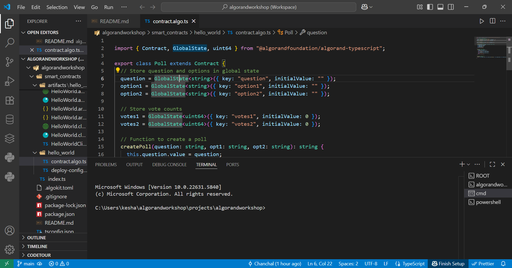

# algorandworkshop

Welcome to your new AlgoKit project!

https://lora.algokit.io/testnet/application/745460835

This is your workspace root. A `workspace` in AlgoKit is an orchestrated collection of standalone projects (backends, smart contracts, frontend apps and etc).

By default, `projects_root_path` parameter is set to `projects`. Which instructs AlgoKit CLI to create a new directory under `projects` directory when new project is instantiated via `algokit init` at the root of the workspace.

## Getting Started

# Contract Address
address: VBL2RJ64BKXWDGGDCX67MDU6CNHKHGIZRWHOMUBKW6TQR4EEJLDM6F4NXU

To get started refer to `README.md` files in respective sub-projects in the `projects` directory.

To learn more about algokit, visit [documentation](https://github.com/algorandfoundation/algokit-cli/blob/main/docs/algokit.md).

### GitHub Codespaces

To get started execute:

1. `algokit generate devcontainer` - invoking this command from the root of this repository will create a `devcontainer.json` file with all the configuration needed to run this project in a GitHub codespace. [Run the repository inside a codespace](https://docs.github.com/en/codespaces/getting-started/quickstart) to get started.
2. `algokit init` - invoke this command inside a github codespace to launch an interactive wizard to guide you through the process of creating a new AlgoKit project

Powered by [Copier templates](https://copier.readthedocs.io/en/stable/).

